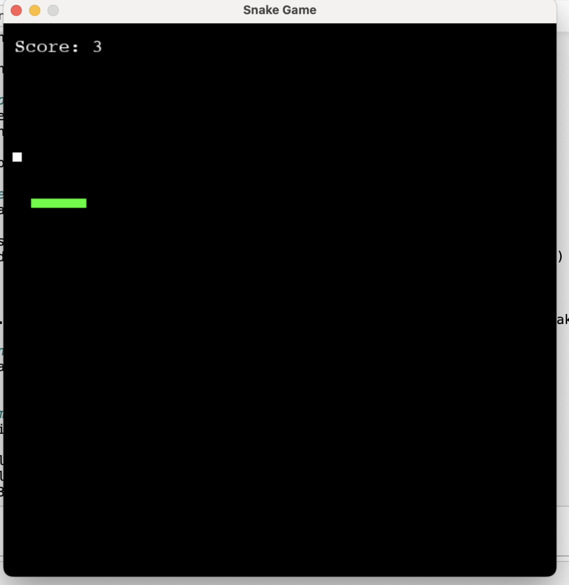

# Snake Game AI with OpenAI Gym

Python, Gymanisum , Pygame, Tensorflow

This project centers around the development of a reinforcement learning model using Python and TensorFlow's CNN layer. The primary objective is to train this model within a custom Snake game environment. It utilizes input from the three most recent image frames of the game to make decisions, selecting optimal actions to maximize its score.

